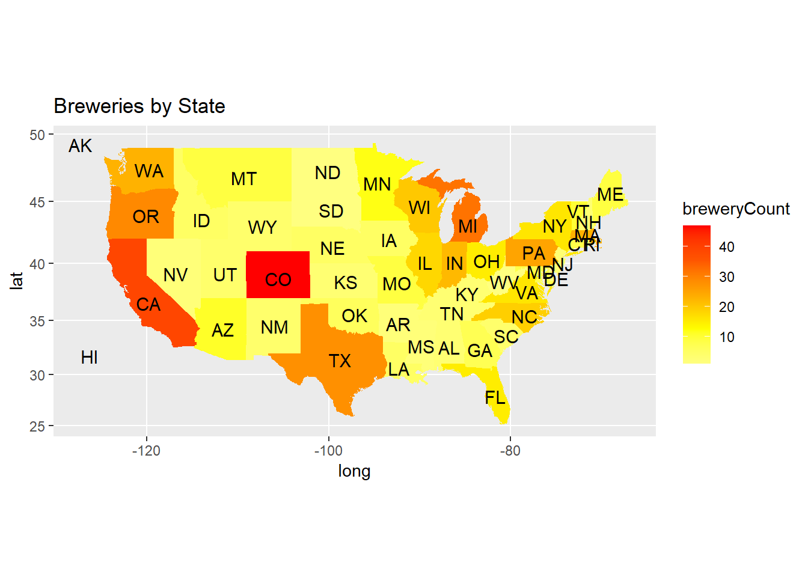
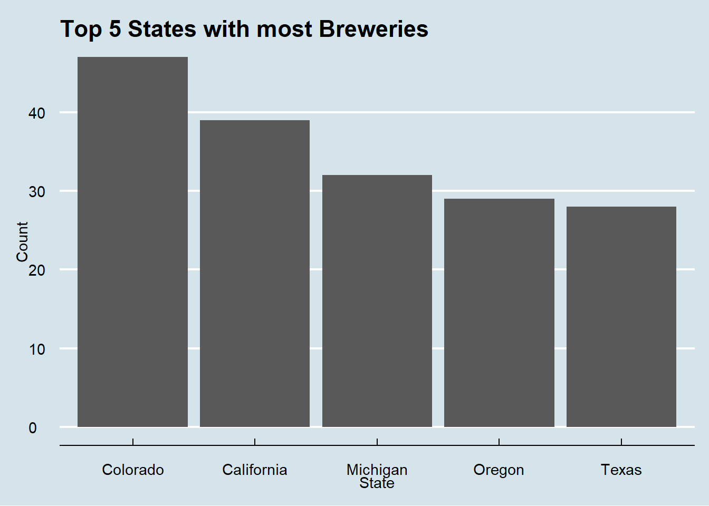
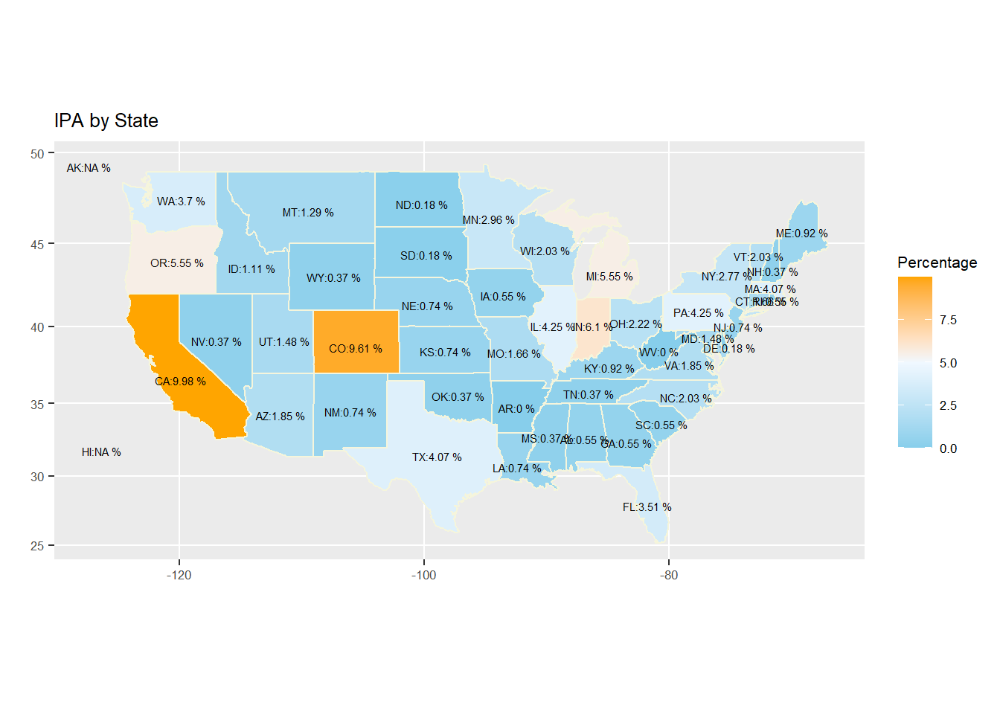
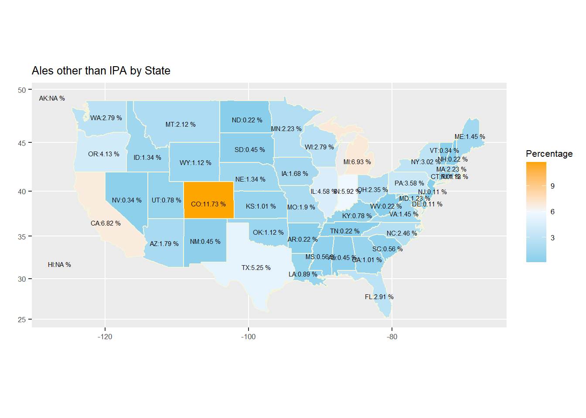

<!DOCTYPE html>

<html>

<head>

<meta charset="utf-8" />
<meta name="generator" content="pandoc" />
<meta http-equiv="X-UA-Compatible" content="IE=EDGE" />

<meta name="author" content="Jake Rastberger, Lijo Jacob" />

<meta name="date" content="2023-02-18" />

<title>Craft Beer Analysis</title>

<h3>
<a href="https://lijojacob12.shinyapps.io/CraftBeerCS1/">Check out Craft Beer Analysis using Shiny App </a>
</h3>

<meta name="viewport" content="width=device-width, initial-scale=1" />
<link href="site_libs/bootstrap-3.3.5/css/bootstrap.min.css" rel="stylesheet" />

<link href="site_libs/highlightjs-9.12.0/default.css" rel="stylesheet" />

<!-- tabsets -->

<!-- code folding -->

</head>

<body>

  

    

      <button type="button" class="navbar-toggle collapsed" data-toggle="collapse" data-bs-toggle="collapse" data-target="#navbar" data-bs-target="#navbar">
        
        
        
      </button>
      <a class="navbar-brand" href="index.html">My Website</a>
    

    

      <ul class="nav navbar-nav">
        <li>
  <a href="index.html">Home</a>
</li>
<li>
  <a href="CraftBeerAnalysis.html">Craft Beer Analysis Document</a>
</li>
      </ul>
      <ul class="nav navbar-nav navbar-right">
        
      </ul>
    
<!--/.nav-collapse -->
  
<!--/.container -->

<!--/.navbar -->

<h1 class="title toc-ignore">Craft Beer Analysis</h1>
<h4 class="author">Jake Rastberger, Lijo Jacob</h4>
<h4 class="date">2023-02-18</h4>

<h2>Libraries</h2>
<pre class="r"><code>library(ggplot2)
library(dplyr)
library(forcats)
library(stringi)
library(stringr)
library(e1071)
library(caret)
library(class)
library(cvms)
library(maps)
library(ggthemes)
library(readxl)
library(tidyverse)
library(RCurl)</code></pre>

<h2>How many breweries are present in each state</h2>

This code first cleans up the breweries data set removing duplicated
data. For example breweries with difference in upper and lower case
letters.

We then join the breweries data set to a US map data set so we can
visualize our finding. Based on the data that we provided the States
with the most breweries are Colorado (47), California (39), Michigan
(32), Oregon (29) and Texas (28).A list of all 50 States and the number
of breweries prints out at the end of this code block

<pre class="r"><code># Read in breweries data
breweryGit &lt;- getURL(
  &quot;https://raw.githubusercontent.com/lijojacob12/DDSCaseStudy1/main/raw_data/Breweries.csv&quot;)
breweriesdf &lt;- read.csv(text = breweryGit, header=TRUE)
# Trim out white space and change case to all upper so we can remove the 
# duplicated breweries
breweriesdf &lt;- breweriesdf %&gt;%
  mutate_if(is.character, str_trim)
breweriesdf &lt;- breweriesdf %&gt;%
  mutate_if(is.character, toupper)

# Remove duplicate Breweries
breweriesdf &lt;- breweriesdf %&gt;%
  distinct(Name, City, State, .keep_all=TRUE)

# Create a look-up table for states
lookup = data.frame(abb = state.abb, StateFN = state.name)

# Replace DC with MD as its the state most of DC falls into and we need all
# records to map to a state for the map graph later
breweriesdf &lt;- breweriesdf %&gt;%
  mutate(State = case_when(State == &quot;DC&quot; ~ &quot;MD&quot;,
                           State != &quot;DC&quot; ~ State))
# Add State info to breweries data set
breweriesdf = merge(breweriesdf, lookup, by.x = &quot;State&quot;, by.y = &quot;abb&quot;)

# Get a count of all breweries in each State
breweriesByStatedf &lt;- breweriesdf %&gt;% group_by(StateFN, State) %&gt;% 
  summarise(breweryCount=n(), .groups = &#39;drop&#39;)

# Join mapping data to count of breweries in each State data
breweriesByStatedf$region &lt;- tolower(breweriesByStatedf$StateFN)
states &lt;- map_data(&quot;state&quot;)
map.df &lt;- merge(states, breweriesByStatedf, by=&quot;region&quot;, all.x=T)
map.df &lt;- map.df[order(map.df$order),]

# Create data for state abbreviation for map graph
centroids &lt;- data.frame(region=tolower(state.name), long=state.center$x, 
                        lat=state.center$y)
centroids$abb &lt;- state.abb[match(centroids$region,tolower(state.name))]

# Plot map
ggplot(map.df, aes(x=long, y=lat, group=group)) +
  geom_polygon(aes(fill=breweryCount)) +
  with(centroids,
       annotate(geom=&quot;text&quot;, x=long, y=lat, label=abb, size=4, color=&quot;black&quot;)) +
  scale_fill_gradientn(colors=rev(heat.colors(5)), na.value=&quot;skyblue&quot;) + 
  ggtitle(&quot;Breweries by State&quot;) +
  coord_map()</code></pre>

<pre class="r"><code># Arrange by bewery count
breweriesByStatedf = breweriesByStatedf %&gt;% arrange(desc(breweryCount))

# Top 5 States
breweriesByStatedf %&gt;% 
  head(sort(breweriesByStatedf$breweryCount, decreasing=TRUE), n=5) %&gt;%
  slice_max(breweryCount, n=5, with_ties=FALSE) %&gt;%
  mutate(State1 = fct_reorder(StateFN, desc(breweryCount))) %&gt;%
  ggplot(aes(x=State1, y=breweryCount)) + 
  geom_bar(stat = &quot;identity&quot;) +
  ggtitle(&quot;Top 5 States with most Breweries&quot;) +
  labs(x=&#39;State&#39;, y=&#39;Count&#39;) +
  theme_economist()</code></pre>

<pre class="r"><code># This will print out the number of breweries in each State    
breweriesByStatedf</code></pre>
<pre><code>## # A tibble: 50 × 4
##    StateFN       State breweryCount region       
##    &lt;chr&gt;         &lt;chr&gt;        &lt;int&gt; &lt;chr&gt;        
##  1 Colorado      CO              47 colorado     
##  2 California    CA              39 california   
##  3 Michigan      MI              32 michigan     
##  4 Oregon        OR              29 oregon       
##  5 Texas         TX              28 texas        
##  6 Pennsylvania  PA              25 pennsylvania 
##  7 Massachusetts MA              23 massachusetts
##  8 Washington    WA              23 washington   
##  9 Indiana       IN              22 indiana      
## 10 Wisconsin     WI              20 wisconsin    
## # … with 40 more rows</code></pre>

<h2>IBV &amp; ABV</h2>

In this section we join the breweries data to the beer data.

There was duplicated data in the beer data set for example beers with
year in the name as well as beers with different oz which was not
relevant to our analysis.

We noticed that there was quite a bit of missing data in both the ABV
and IBU columns. After running the commented out R code we discovered
that the data was not missing completely at random with certain
breweries missing all ABV and IBU columns.Based on this we manually got
the data from external sources (untappd.com). We still couldn’t find all
of the missing data so for the remaining 23 beers with missing ABV data
we dropped them from the data set. We then imputed the mean of IBU by
style for the remaining missing IBU data.

<pre class="r"><code># Read in the data that has been manually updated (replaced all missing ABU 
# values that could be found)
beerGit &lt;- getURL(
  &quot;https://raw.githubusercontent.com/lijojacob12/DDSCaseStudy1/main/raw_data/beers_data_updated.csv&quot;)
beersnewdf &lt;- read.csv(text = beerGit, header=TRUE)
newbbjoinddf &lt;- merge(beersnewdf, breweriesdf, by.x = &quot;Brewery_id&quot;, 
                      by.y = &quot;Brew_ID&quot;)
colnames(newbbjoinddf)[which(names(newbbjoinddf) == &quot;Name.x&quot;)] &lt;- &quot;Beer_Name&quot;
colnames(newbbjoinddf)[which(names(newbbjoinddf) == &quot;Name.y&quot;)] &lt;- &quot;Brewery_Name&quot;

# Print first and last 6 observations in this data set
head(newbbjoinddf)</code></pre>
<pre><code>##   Brewery_id     Beer_Name Beer_ID   ABV IBU                               Style Ounces State
## 1          1  Get Together    2692 0.045  50                        American IPA     16    MN
## 2          1 Maggie&#39;s Leap    2691 0.049  26                  Milk / Sweet Stout     16    MN
## 3          1    Wall&#39;s End    2690 0.048  19                   English Brown Ale     16    MN
## 4          1       Pumpion    2689 0.060  38                         Pumpkin Ale     16    MN
## 5          1    Stronghold    2688 0.060  25                     American Porter     16    MN
## 6          1   Parapet ESB    2687 0.056  47 Extra Special / Strong Bitter (ESB)     16    MN
##        Brewery_Name        City   StateFN
## 1 NORTHGATE BREWING MINNEAPOLIS Minnesota
## 2 NORTHGATE BREWING MINNEAPOLIS Minnesota
## 3 NORTHGATE BREWING MINNEAPOLIS Minnesota
## 4 NORTHGATE BREWING MINNEAPOLIS Minnesota
## 5 NORTHGATE BREWING MINNEAPOLIS Minnesota
## 6 NORTHGATE BREWING MINNEAPOLIS Minnesota</code></pre>
<pre class="r"><code>tail(newbbjoinddf)</code></pre>
<pre><code>##      Brewery_id                 Beer_Name Beer_ID   ABV IBU                   Style Ounces State
## 2403        556             Pilsner Ukiah      98 0.055  NA         German Pilsener     12    CA
## 2404        557  Heinnieweisse Weissebier      52 0.049  NA              Hefeweizen     12    NY
## 2405        557           Snapperhead IPA      51 0.068  NA            American IPA     12    NY
## 2406        557         Moo Thunder Stout      50 0.049  NA      Milk / Sweet Stout     12    NY
## 2407        557         Porkslap Pale Ale      49 0.043  NA American Pale Ale (APA)     12    NY
## 2408        558 Urban Wilderness Pale Ale      30 0.049  NA        English Pale Ale     12    AK
##                       Brewery_Name          City    StateFN
## 2403         UKIAH BREWING COMPANY         UKIAH California
## 2404       BUTTERNUTS BEER AND ALE GARRATTSVILLE   New York
## 2405       BUTTERNUTS BEER AND ALE GARRATTSVILLE   New York
## 2406       BUTTERNUTS BEER AND ALE GARRATTSVILLE   New York
## 2407       BUTTERNUTS BEER AND ALE GARRATTSVILLE   New York
## 2408 SLEEPING LADY BREWING COMPANY     ANCHORAGE     Alaska</code></pre>
<pre class="r"><code># Remove Dates from beer names ex: Undertaker and Undertaker (2014)
newbbjoinddf$Beer_Name &lt;- str_remove_all(newbbjoinddf$Beer_Name, &#39;[(\\d{4})]&#39;)

# Remove Duplicates based on beer name, brewery and style this will get rid of 
# the before mentioned beer with dates as well as beers with just different oz
newbbjoinddf &lt;- newbbjoinddf %&gt;%
  distinct(Beer_Name, Brewery_id, Style, .keep_all=TRUE)

# You can use the below code if you load new data to check if there is any 
# evidence that the data is not missing at random and if so you can narrow down
# what you need to manually replace
# bbjoinddf %&gt;%
#   mutate(missing_ABV = case_when(is.na(ABV) ~ 1,
#                                  !is.na(ABV) ~ 0)
#          ) %&gt;% # create is missing column
#   group_by(Brewery_id) %&gt;%
#   summarize(mean=mean(missing_ABV),
#             count=n()) %&gt;%
#   filter(mean &gt; 0.05)
# 
# newbbjoinddf %&gt;%
#   mutate(missing_ABV = case_when(is.na(ABV) ~ 1,
#                                  !is.na(ABV) ~ 0)
#          ) %&gt;% # create is missing column
#   group_by(Brewery_id) %&gt;%
#   summarize(mean=mean(missing_ABV),
#             count=n()) %&gt;%
#   filter(mean &gt; 0.05)
# 
# newbbjoinddf %&gt;%
#   mutate(missing_ABV = case_when(is.na(ABV) ~ 1,
#                                  !is.na(ABV) ~ 0)
#          ) %&gt;% # create is missing column
#   group_by(Style) %&gt;%
#   summarize(mean=mean(missing_ABV),
#             count=n(),
#             sum(missing_ABV)) %&gt;%
#   filter(mean &gt; 0.05)
# 
# newbbjoinddf %&gt;%
#   mutate(missing_IBU = case_when(is.na(IBU) ~ 1,
#                                  !is.na(IBU) ~ 0)
#          ) %&gt;% # create is missing column
#   group_by(Style) %&gt;%
#   summarize(mean=mean(missing_IBU),
#             count=n(),
#             sum=sum(missing_IBU)) %&gt;%
#   filter(mean &gt; 0.5) 
# 
# newbbjoinddf %&gt;%
#   mutate(missing_IBU = case_when(is.na(IBU) ~ 1,
#                                  !is.na(IBU) ~ 0)
#          ) %&gt;% # create is missing column
#   group_by(Brewery_id) %&gt;%
#   summarize(mean=mean(missing_IBU),
#             count=n(),
#             sum=sum(missing_IBU)) %&gt;%
#   filter(mean &gt;= .5 &amp; count &gt;= 10) 

# Delete all NA ABV because we couldn&#39;t find values
newbbjoinddf &lt;- newbbjoinddf %&gt;% filter(!is.na(ABV))

# Find Mean and fill in missing IBU values
# Separate data based on if IBU is in the data
bbjoinddf1 = newbbjoinddf %&gt;% filter(!is.na(IBU))
bbjoinddf2 = newbbjoinddf %&gt;% filter(is.na(IBU))
# Compute the mean of IBU for all styles
bbaggrdf = bbjoinddf1 %&gt;% group_by(Style) %&gt;% summarize(Mean=mean(IBU))
# Merge mean IBU for style into data set that doesn&#39;t have IBU
bbfillmngDF = merge(bbjoinddf2, bbaggrdf, by = &quot;Style&quot;)
bbfillmngDF &lt;- bbfillmngDF[-c(6)]
colnames(bbfillmngDF)[11]=&quot;IBU&quot;
# Combine all data back together to get one data set again
mergedDf = union(bbjoinddf1,bbfillmngDF)</code></pre>

<h2>Compute the median alcohol content and international bitterness unit
for each state. Plot a bar chart to compare.</h2>

The median IBU is 33 and the median ABV is 0.056 for this data set.
One thing to note is for the median ABV data set by State Utah has a
regulation where you can not sell beers with more than 5% ABV which is
why the median is so low.

The reason why West Virginia has an extremely high IBU is because
West Virginia only has two beers in this data set which is messing with
the results.

<pre class="r"><code># create data frames for median for ABV and IBU by State 
mergedDfIBU = mergedDf %&gt;% group_by(State) %&gt;% summarize(Median_IBU=median(IBU))
mergedDfABV = mergedDf %&gt;% group_by(State) %&gt;% summarize(Median_ABV=median(ABV))
# Get overall median for ABV and IBU 
medianIBU = mergedDf %&gt;% summarize(Median_IBU=median(IBU)) #33
medianABV = mergedDf %&gt;% summarize(Median_ABV=median(ABV)) #0.056

# Create plot for median ABV
mergedDfABV %&gt;% mutate(State1 = fct_reorder(State, desc(Median_ABV))) %&gt;% 
  ggplot(aes(x=State1, y = Median_ABV)) + 
  geom_bar(stat = &quot;identity&quot;, color=&quot;darkslategray4&quot;, fill=&quot;honeydew2&quot;) +
  ggtitle(&quot;Median ABV by State&quot;) +
  labs(x=&#39;States&#39;, y=&#39;Median ABV&#39;) +
  geom_hline(yintercept=0.056, linetype=&quot;dashed&quot;, color = &quot;gray47&quot;,size = 2) +
  annotate(&quot;text&quot;, x=&quot;MT&quot;, y=0.059, label=&quot;Overall Median ABV&quot;,color = &quot;gray47&quot;,size = 4) +
  scale_y_continuous(breaks = sort(c(seq(min(0), max(.06), length.out=5), 0.056)))+
  theme(axis.text.x = element_text(angle = 90))  +
  theme(text = element_text(size = 12)) </code></pre>

<pre class="r"><code># Create plot for median IBU
mergedDfIBU %&gt;% mutate(State1 = fct_reorder(State, desc(Median_IBU))) %&gt;% 
  ggplot(aes(x=State1, y = Median_IBU)) + 
  geom_bar(stat = &quot;identity&quot;, color=&quot;darkslategray4&quot;, fill=&quot;honeydew2&quot;) +
  ggtitle(&quot;Median IBU by State&quot;) +
  labs(x=&#39;States&#39;, y=&#39;Median IBU&#39;) +
  geom_hline(yintercept=33, linetype=&quot;dashed&quot;, color = &quot;gray47&quot;,size = 2) +
  annotate(&quot;text&quot;, x=&quot;NC&quot;, y=36, label=&quot;Overall Median IBU&quot;,color = &quot;gray47&quot;,size = 4) +
  scale_y_continuous(breaks = sort(c(seq(min(0), max(60), length.out=5), 33))) +
  theme(axis.text.x = element_text(angle = 90))  + 
  theme(text = element_text(size = 12)) </code></pre>

<h2>Which state has the maximum alcoholic (ABV) beer? Which state has
the most bitter (IBU) beer?</h2>

Colorado does not have a maximum ABV limit for beer sold in stores or
served in restaurants and bars Colorado’s high altitude can affect the
brewing process, leading to a higher ABV in some beers. Colorado has a
long history of craft brewing which allows experimentation and
innovation.

Lee Hill Series Vol. 5 - Belgian Style Quadrupel Ale by Upslope
Brewing Company in Boulder, Colorado has maximum ABV(12.8%)

Bitter Bitch Imperial IPA by Astoria Brewing Company in Astoria,
Oregon is the most bitter beer with 138 IBU.

Bitter Bitch Imperial IPA The high bitterness is achieved through the
use of a blend of six different hops.

<pre class="r"><code># State with highest ABV
max_abv &lt;- mergedDf %&gt;% group_by(State) %&gt;% summarize(Max=max(ABV)) %&gt;% 
  arrange(desc(Max))
head(max_abv,1)</code></pre>
<pre><code>## # A tibble: 1 × 2
##   State   Max
##   &lt;chr&gt; &lt;dbl&gt;
## 1 CO    0.128</code></pre>
<pre class="r"><code># Beer with highest ABV
mergedDf %&gt;% filter(ABV==0.128)</code></pre>
<pre><code>##   Brewery_id                                           Beer_Name Beer_ID   ABV  IBU            Style Ounces
## 1         52 Lee Hill Series Vol.  - Belgian Style Quadrupel Ale    2565 0.128 24.5 Quadrupel (Quad)   19.2
##   State            Brewery_Name    City  StateFN
## 1    CO UPSLOPE BREWING COMPANY BOULDER Colorado</code></pre>
<pre class="r"><code>max_ibu &lt;- mergedDf %&gt;% group_by(State) %&gt;% summarize(Max=max(IBU)) %&gt;% 
  arrange(desc(Max))

# State with highest IBU
head(max_ibu,1)</code></pre>
<pre><code>## # A tibble: 1 × 2
##   State   Max
##   &lt;chr&gt; &lt;dbl&gt;
## 1 OR      138</code></pre>
<pre class="r"><code># Beer with highest IBU
mergedDf %&gt;% filter(IBU==138)</code></pre>
<pre><code>##   Brewery_id                 Beer_Name Beer_ID   ABV IBU                          Style Ounces State
## 1        375 Bitter Bitch Imperial IPA     980 0.082 138 American Double / Imperial IPA     12    OR
##              Brewery_Name    City StateFN
## 1 ASTORIA BREWING COMPANY ASTORIA  Oregon</code></pre>

<h2>Comment on the summary statistics and distribution of the ABV
variable.</h2>

The mean (5.97%) is greater than the median (5.6%) so this data is
slightly right skewed.

When you break out summary statistics by beer type (IPA, Other Ales,
Other beers) IPAs are normally distributed but Other Ales and Other
beers are still right skewed.

<pre class="r"><code># Summary statistics for data set
summary(mergedDf$ABV)</code></pre>
<pre><code>##    Min. 1st Qu.  Median    Mean 3rd Qu.    Max. 
## 0.02700 0.05000 0.05600 0.05984 0.06800 0.12800</code></pre>
<pre class="r"><code># Box plot of data to provide more context of summary statistics
mergedDf %&gt;% ggplot(aes(x=ABV)) + geom_boxplot()</code></pre>

<pre class="r"><code># Adding new column called &quot;Typ&quot; that classifies IPAs, Other Ales, and Other
# beers
AllBeersDF = mergedDf %&gt;% filter(!is.na(ABV)) %&gt;%
  mutate(Typ= case_when(
    stringr::str_detect(toupper(Style), &quot;\\bIPA\\b&quot;)~&quot;IPA&quot;,
    stringr::str_detect(toupper(Style), &quot;\\bALE\\b&quot;)~&quot;Other Ales&quot;,
    TRUE~&quot;Other Beers&quot;))

# Count the number of each &quot;Typ&quot; of beer
AllBeersDF %&gt;% group_by(Typ) %&gt;% count()</code></pre>
<pre><code>## # A tibble: 3 × 2
## # Groups:   Typ [3]
##   Typ             n
##   &lt;chr&gt;       &lt;int&gt;
## 1 IPA           541
## 2 Other Ales    895
## 3 Other Beers   781</code></pre>
<pre class="r"><code># Distribution for all ABV
AllBeersDF %&gt;% ggplot(aes(x = ABV, fill = Typ)) + 
  geom_bar(stat = &quot;count&quot;,width = .0008) +
  ggtitle(&quot;Overall ABV Distribution&quot;) + 
  ylab(&quot;Count&quot;) + 
  theme(text = element_text(size = 16)) </code></pre>

<pre class="r"><code># Distribution for each type ABV
AllBeersDF %&gt;% ggplot(aes(x = ABV, fill = Typ)) + 
  geom_bar(stat = &quot;count&quot;,width = .0008) +
  ggtitle(&quot;ABV Distribution for Beer Types&quot;) +
  ylab(&quot;Count&quot;)  +
  facet_wrap(~Typ)  + 
  theme(text = element_text(size = 8)) </code></pre>

<h2>Is there an apparent relationship between the bitterness of the beer
and its alcoholic content? Draw a scatter plot. Make your best judgment
of a relationship and EXPLAIN your answer.</h2>

The evidence suggest that there is a positive relationship between
IBU and ABV.

Soft cap on ABV at 10% which might be due to state regulations in
some of the states.

By looking at the data based on Type of beers, IPAs tend to have more
bitterness for same Alcohol content when compared with other Ales and
other type of beers.

<pre class="r"><code># Scatter plot of overall relationship between IBU and ABV 
AllBeersDF %&gt;% ggplot(aes(x=IBU,y=ABV)) +
  geom_point(position = &quot;jitter&quot;) +
  geom_smooth(method = lm) +
  ggtitle(&quot;IBU - ABV Relationship&quot;) +
  theme(text = element_text(size = 16)) </code></pre>

<pre class="r"><code># Scatter plot of relationship between IBU and ABV by type
AllBeersDF %&gt;% ggplot(aes(x=IBU,y=ABV, color = Typ)) +
  geom_point(position = &quot;jitter&quot;) +
  geom_smooth(method = lm) +
  ggtitle(&quot;IBU - ABV Relationship for Beer Types&quot;) +
  facet_wrap(~Typ) +
  theme(text = element_text(size = 16)) </code></pre>

<h2>Use KNN to investigation the relationship between ABV and IBU</h2>

We first determined the optimal value for K by iteration over random
samples of test and train data 200 times for the values of K ranging
from 1-20. The optimal value was 5 for this data set.

Using 5 for K in our KNN classifier we were able to achieve ~90%
accuracy in classifying beer type in the data.

Visualizing the classification we can clearly see that there is a
dividing line between IPAs and Other Ales around 50 IBUs.

<pre class="r"><code># Create function to iterate over random samples of test and training data to 
# help determine the optimal value for K
knn_loop &lt;- function(iterations, num_of_k_s, split_percent, data_for_model,
                     data_start_column, data_end_column, label_column) {
  # This functions assumes all labeling data is either at the end or the 
  # beginning of your data frame.
  
  # Create a matrix to store accuracy
  masterAcc = matrix(nrow = iterations, ncol = numks)

  for(j in 1:iterations)
  { 
    # create a random sample split data for training and testing
    trainIndices = sample(1:dim(data_for_model)[1],
                        round(splitPerc * dim(data_for_model)[1]))
    train = data_for_model[trainIndices,]
    test = data_for_model[-trainIndices,]
    for(i in 1:numks)
    {
      # Create KNN model and store its classifications for test data in a 
      # variable.
      classifications = knn(train[,data_start_column:data_end_column], 
                            test[,data_start_column:data_end_column], 
                            train[[label_column]], 
                            k = i, 
                            prob = TRUE
                            )
      CM = confusionMatrix(table(classifications, test[[label_column]]))
      # store the accuracy for this loop in the accuracy matrix
      masterAcc[j,i] = CM$overall[1]
    }
  }
  
  MeanAcc = colMeans(masterAcc)
  return(MeanAcc)
}

# Split data frame into IPA and Other Ales and label them respectively
NonIPAAledf = mergedDf %&gt;% filter(!is.na(ABV) &amp;  !is.na(IBU)) %&gt;%
  filter(!str_detect(Style, &quot;IPA&quot;)) %&gt;%
  filter(str_detect(Style, &quot;Ale&quot;)) %&gt;% mutate(Typ= &quot;Other Ales&quot;)

IPAdf = mergedDf %&gt;% 
  filter(!is.na(ABV) &amp;  !is.na(IBU)) %&gt;% 
  filter(str_detect(Style, &quot;IPA&quot;)) %&gt;% 
  mutate(Typ= &quot;IPA&quot;)

# Join data back together after labeling
Ales_DF = union(IPAdf,NonIPAAledf)

# Set up parameters for KNN loop
iterations = 200
numks = 20
splitPerc = .7

# Run the loop for the desired amount of iterations and values for k to find 
# optimal value of K to use on this data set
MeanAcc = 
  knn_loop(iterations=iterations, num_of_k_s=numks, split_percent=splitPerc,
           data_for_model=Ales_DF, data_start_column=4, data_end_column=5,
           label_column=&quot;Typ&quot;)

# Turn Mean Acc into a df
sequence_of_k_s = seq(1,numks,1)
Mean_Acc_df = as.data.frame(MeanAcc)
Mean_Acc_df$K_value = sequence_of_k_s

# Create a graph of average accuracy across all values for k
Mean_Acc_df %&gt;%
  ggplot(aes(x=K_value, y=MeanAcc)) +
  geom_line() +
  ggtitle(&quot;Accuracy across values of K&quot;) +
  labs(x=&#39;Number for K&#39;, y=&#39;Accuracy&#39;) +
  theme_economist()</code></pre>

<pre class="r"><code># Run KNN again with the optimal value of k found in above graph.
trainIndices = sample(1:dim(Ales_DF)[1],
                      round(splitPerc * dim(Ales_DF)[1]))
train = Ales_DF[trainIndices,]
test = Ales_DF[-trainIndices,]

classifications = knn(train[,4:5], 
                      test[,4:5], 
                      train[[&quot;Typ&quot;]], 
                      k = 5
                      )

# Create confusion matrix of results
# CM = confusionMatrix(table(classifications, test[[&quot;Typ&quot;]]))
# CM
# Create table of classification to use in &quot;plot_confusion_matrix&quot; to create 
# nice visual of confusion matrix
df1 = data.frame(classifications, test$Typ)
basic_table =table(classifications, test$Typ)
basic_table =table(df1)

cfm &lt;- as_tibble(basic_table)
plot_confusion_matrix(cfm, 
                      target_col = &quot;test.Typ&quot;, 
                      prediction_col = &quot;classifications&quot;,
                      counts_col = &quot;n&quot;)</code></pre>

<pre class="r"><code># create data frame to show how well our KNN classifier predicted the different
# types of beers
Ales_Results_DF &lt;- test
Ales_Results_DF$knn_label = classifications
# Create Boolean column if KNN classified correctly
Ales_Results_DF &lt;- Ales_Results_DF %&gt;% 
  mutate(correct_label = case_when(Typ != knn_label ~ 0,
                                   Typ == knn_label ~ 1))
Ales_Results_DF$correct_label &lt;- as.factor(Ales_Results_DF$correct_label)
# Create graph of lables with dividing line at 50 IBU which was determined to be
# a good dividing line based on current data set.
Ales_Results_DF %&gt;%
  ggplot(aes(y=IBU, x=ABV, color=correct_label, shape=Typ)) +
  geom_point(position = &quot;jitter&quot;) +
  geom_hline(yintercept=50, linetype=&quot;dashed&quot;, color = &quot;gray47&quot;, size = 2) +
  annotate(&quot;text&quot;, x=.03, y=55, label=&quot;50&quot;,color = &quot;gray47&quot;,size = 4) +
  ggtitle(&quot;Results of KNN Model on Test Data&quot;) +
  labs(color=&quot;Correct Label&quot;, shape=&quot;Ale Type&quot;)</code></pre>

<h2>Knock their socks off! Find one other useful inference from the data
that you feel Budweiser may be able to find value in. You must convince
them why it is important and back up your conviction with appropriate
statistical evidence.</h2>

Our recommendation is to release a new beer IPA or Ale in the
Florida/Georgia as there is the most opportunity in the state based on
our analysis.

<pre class="r"><code># Picking up only IPA and Ales
IPA_DF = AllBeersDF %&gt;% filter(Typ %in% c(&quot;IPA&quot; ))
Ales_DF = AllBeersDF %&gt;% filter(Typ %in% c(&quot;Other Ales&quot; ))

# Map to State data set
stateLkp = data.frame(State = state.abb, StateFulNM = state.name)
IPA_DFa = merge(stateLkp,IPA_DF, by = &quot;State&quot;, all.x = TRUE)
IPA_DFSt = IPA_DFa %&gt;% group_by(StateFulNM,Typ) %&gt;% summarize(cnt=n()) %&gt;% arrange(cnt)
Ales_DFa = merge(stateLkp,Ales_DF, by = &quot;State&quot;, all.x = TRUE)
Ales_DFSt = Ales_DFa %&gt;% group_by(StateFulNM,Typ) %&gt;% summarize(cnt=n()) %&gt;% arrange(cnt)
colnames(IPA_DFSt)[1] = &quot;StateName&quot;
colnames(Ales_DFSt)[1] = &quot;StateName&quot;
# Identify the percentages of IPA and Ales by State
IPA_DFSt = IPA_DFSt %&gt;% mutate(cnt = if(is.na(Typ)) 0 else cnt)
IPA_DFSt$Total = sum(IPA_DFSt$cnt)
IPA_DFSt$Percentage = round((IPA_DFSt$cnt/IPA_DFSt$Total)*100,2)

Ales_DFSt = Ales_DFSt %&gt;% mutate(cnt = if(is.na(Typ)) 0 else cnt)
Ales_DFSt$Total = sum(Ales_DFSt$cnt)
Ales_DFSt$Percentage = round((Ales_DFSt$cnt/Ales_DFSt$Total)*100,2)

# Join mapping data to count of breweries in each State data IPA data
IPA_DFSt$region &lt;- tolower(IPA_DFSt$StateName)
states &lt;- map_data(&quot;state&quot;)
map.df &lt;- merge(states, IPA_DFSt, by=&quot;region&quot;, all.x=T)
map.df &lt;- map.df[order(map.df$order),]

centroids &lt;- data.frame(region=tolower(state.name), long=state.center$x, 
                        lat=state.center$y)
centroids$abb &lt;- state.abb[match(centroids$region,tolower(state.name))]

centroids$percent &lt;- paste(map.df$Percentage[match(centroids$region,map.df$region)],&quot;%&quot;,&quot;&quot;)
centroids$abbpercent &lt;- paste(centroids$abb, centroids$percent, sep= &quot;:&quot;)

# Plot IPA map
ggplot(map.df, aes(x=long, y=lat, group=group)) +
  geom_polygon(aes(fill=Percentage)) +
  geom_path(color=&quot;beige&quot;) +
  with(centroids,
       annotate(geom=&quot;text&quot;, x=long, y=lat, label=abbpercent, size=2, color=&quot;black&quot;)) +
  scale_fill_gradientn(colors = c(&quot;skyblue&quot;, &quot;aliceblue&quot;, &quot;orange&quot;), na.value=&quot;grey50&quot;) + 
  ggtitle(&quot;IPA by State&quot;) + xlab(&quot;&quot;)+ ylab(&quot;&quot;) +
  coord_map() +
  theme(text = element_text(size = 8)) </code></pre>

<pre class="r"><code># Join mapping data to count of breweries in each State data Ale data
Ales_DFSt$region &lt;- tolower(Ales_DFSt$StateName)
states &lt;- map_data(&quot;state&quot;)
map.df &lt;- merge(states, Ales_DFSt, by=&quot;region&quot;, all.x=T)
map.df &lt;- map.df[order(map.df$order),]

centroids &lt;- data.frame(region=tolower(state.name), long=state.center$x, 
                        lat=state.center$y)
centroids$abb &lt;- state.abb[match(centroids$region,tolower(state.name))]

centroids$percent &lt;- paste(map.df$Percentage[match(centroids$region,map.df$region)],&quot;%&quot;,&quot;&quot;)
centroids$abbpercent &lt;- paste(centroids$abb, centroids$percent, sep= &quot;:&quot;)
# Plot map
ggplot(map.df, aes(x=long, y=lat, group=group)) +
  geom_polygon(aes(fill=Percentage)) +
  geom_path(color=&quot;beige&quot;) +
  with(centroids,
       annotate(geom=&quot;text&quot;, x=long, y=lat, label=abbpercent, size=2, color=&quot;black&quot;)) +
  scale_fill_gradientn(colors = c(&quot;skyblue&quot;, &quot;aliceblue&quot;, &quot;orange&quot;), na.value=&quot;grey50&quot;) + 
  ggtitle(&quot;Ales other than IPA by State&quot;) + xlab(&quot;&quot;)+ ylab(&quot;&quot;) + 
  coord_map() +
  theme(text = element_text(size = 8)) </code></pre>

<h2>Summary</h2>

Breweries seems to be clustered along the west cost, northeast and
eastern Midwest US.

The evidence suggest as IBU goes up so does ABV.

The evidence suggest that a common defining factor between IPAs and
Other Ales is IBU.

To introduce new beers, Budweiser should look to release a new IPA or
Ale in Florida and/or Georgia.

<!-- tabsets -->

<!-- code folding -->

<!-- dynamically load mathjax for compatibility with self-contained -->

</body>
</html>
